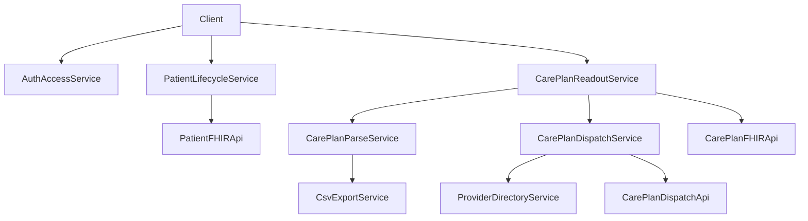

# request.pdhc — Unified Functional Service Specification

## 1) Purpose

`request.pdhc` is the unified service boundary that combines all functional capabilities currently split across:

- `standalone-careplan-readout`
- `standalone-patient-generator`

This document is intentionally **function-first** and meant to serve as a baseline for recoding the repository. It defines:

- what services exist,
- what each service does,
- the input/output contracts,
- dependencies and failure modes,
- and the required backend endpoint coverage.

No frontend visual/style guidance is included.

---

## 2) Service Scope and Boundaries

### In scope

- Patient lifecycle operations used by current standalones:
  - create, read, list/search/filter, delete, duplicate (client-side pattern)
- CarePlan readout operations:
  - list/search/filter, read detail, parse to transaction rows
- CSV extraction/export operations from CarePlan transaction structure
- CarePlan dispatch operations to provider recipients
- Provider directory retrieval for dispatch workflows
- Authentication/access enforcement as required by backend endpoints

### Out of scope

- UI layout/design rules, component styling, CSS themes
- Non-related subsystems in the monolith (admin tarball, unrelated workflow screens, etc.)
- Complete replacement architecture decisions (this doc provides contract baseline, not final infra choice)

---

## 3) Unified Capability Catalog (All Three Views)

This section intentionally blends:

- product-level description (what business capability exists),
- plain-language operational description (how it behaves),
- technical contract description (what API/service must exist).

## 3.1 Patient Lifecycle Service

**Purpose**  
Manage FHIR Patient records as primary subject entities.

**Functional operations**

- List patients (with pagination/search/filter support)
- Read one patient by ID
- Create patient
- Delete patient
- Duplicate patient (compose read + create with field carry-over)
- Update patient (required for recode parity; currently incomplete in standalone)

**Current backend contract used**

- `GET /api/v1/Patient`
- `GET /api/v1/Patient/{id}`
- `POST /api/v1/Patient`
- `DELETE /api/v1/Patient/{id}`

**Key entity fields used in flows**

- `id`
- `name[]` (`family`, `given`)
- `gender`, `birthDate`, `active`
- `maritalStatus`
- `telecom[]`
- `address[]`
- `identifier[]`

**Required recode guarantees**

- deterministic list behavior
- robust handling of FHIR `Bundle` and `OperationOutcome`
- strict validation for create/update payloads
- auditable delete operations

## 3.2 CarePlan Readout Service

**Purpose**  
Fetch and inspect CarePlans to support operational readout and downstream processing.

**Functional operations**

- List CarePlans with filters (`subject`, `status`, query text)
- Read single CarePlan in full detail
- Show activity/goal/transaction-level data for downstream transformation

**Current backend contract used**

- `GET /api/v1/CarePlan`
- `GET /api/v1/CarePlan/{id}`

**Key behavior**

- Supports large enough list window for operational screens (currently `_count=100` pattern)
- Maintains compatibility with variable CarePlan structures (missing optional fields)
- Produces structured content consumable by parser/export services

## 3.3 CarePlan Parse and Normalization Service

**Purpose**  
Transform CarePlan structures into normalized transaction rows for export, analytics, and dispatch preparation.

**Functional operations**

- Parse `activity[]`, nested details/extensions, and goals
- Normalize concept metadata, requirement metadata, expected values/ranges
- Preserve order (`sort_order` or equivalent)
- Produce flat, deterministic row model

**Key outputs**

- transaction row set (one row per actionable transaction)
- enriched fields for plan/activity/transaction/concept/goal context

**Required recode guarantees**

- idempotent transformation for same input
- strict fallback defaults for missing fields
- explicit parse error reporting with partial-success handling policy

## 3.4 CSV Export Service

**Purpose**  
Generate operational CSV output from parsed CarePlan transaction rows.

**Functional operations**

- Build CSV headers and rows from normalized transaction model
- Preview data before download (optional in UI, mandatory capability in service terms)
- Download/export CSV artifact

**Output contract**

- UTF-8 CSV
- stable header order
- escaping rules for commas/quotes/newlines
- deterministic file naming convention

**Required recode guarantees**

- schema versioning for CSV headers
- backwards compatibility policy for downstream consumers

## 3.5 CarePlan Dispatch Service

**Purpose**  
Dispatch a selected CarePlan to a selected provider with optional assignment metadata.

**Functional operations**

- Validate dispatch request inputs:
  - careplan id
  - provider id
  - optional assigned user
  - optional dispatch notes
- Submit dispatch request
- Return dispatch receipt/token and status

**Current backend contract used**

- `POST /api/v1/CarePlan/{id}/dispatch`

**Required recode guarantees**

- idempotency strategy for repeated submits
- provider existence/active checks
- dispatch receipt traceability
- clear failure taxonomy (validation/auth/not-found/server)

## 3.6 Provider Directory Service

**Purpose**  
Provide dispatch targets and provider metadata.

**Functional operations**

- List providers
- Filter active/inactive providers
- Return stable IDs used by dispatch contract

**Current backend contract used**

- `GET /api/v1/providers`

---

## 4) Cross-Cutting Access and Authentication Service

`request.pdhc` must support mixed auth contexts already present in runtime behavior:

- session-based authentication (`credentials: include`)
- API key forwarding (`X-API-Key`)
- role-based checks at backend endpoints

### Existing related endpoints

- `GET/POST /auth/login` (web flow)
- `POST /api/v1/auth/login`
- `POST /api/v1/auth/logout`
- `GET /api/v1/auth/me`
- `GET /api/v1/auth/token`

### Required recode rules

- single documented auth mode policy per endpoint
- explicit support matrix: session, bearer, API key
- consistent `401` vs `403` semantics
- clear client recovery guidance

---

## 5) End-to-End Functional Flows



## 5.1 Patient management flow

1. Authenticate access context.
2. List/search patients.
3. Read full patient record as needed.
4. Create/update/delete operations performed with validation.
5. Return normalized success/error contract.

## 5.2 CarePlan readout and export flow

1. List CarePlans with filter criteria.
2. Fetch selected CarePlan detail.
3. Parse/normalize into transaction rows.
4. Generate preview and export CSV artifact.
5. Persist operation logs/metrics.

## 5.3 CarePlan dispatch flow

1. Load providers.
2. Validate dispatch payload.
3. Submit dispatch request.
4. Return dispatch receipt token.
5. Expose auditable dispatch status/events.

---

## 6) Entity Model Baseline for Recode

These entities are functionally required across the unified service.

- `Patient`
- `CarePlan`
- `Goal`
- `Activity`
- `Transaction` (normalized actionable unit derived from activity details)
- `Provider`
- `DispatchRequest`
- `DispatchReceipt`
- `OperationError` / `OperationOutcome`

### Contract notes

- FHIR resources remain canonical for Patient/CarePlan exchange.
- Internal normalized `Transaction` model is required for stable export/dispatch behavior.
- `DispatchReceipt` must include traceable token/id and timestamps.

---

## 7) Backend Endpoint Map (Required Coverage)

## 7.1 Directly used by current standalones

- `GET /api/v1/Patient` -> list/search patients
- `GET /api/v1/Patient/{id}` -> read patient
- `POST /api/v1/Patient` -> create patient
- `DELETE /api/v1/Patient/{id}` -> delete patient
- `GET /api/v1/CarePlan` -> list/search careplans
- `GET /api/v1/CarePlan/{id}` -> read careplan
- `POST /api/v1/CarePlan/{id}/dispatch` -> dispatch careplan
- `GET /api/v1/providers` -> provider directory

## 7.2 Required additions/normalization for recode

- `PUT /api/v1/Patient/{id}` or `PATCH /api/v1/Patient/{id}` for true update parity
- formalized dispatch status endpoint (recommended):
  - `GET /api/v1/CarePlan/{id}/dispatch/{receipt_token}`
- stable export endpoint (recommended if server-side export is desired):
  - `POST /api/v1/CarePlan/{id}/export/csv` or equivalent

## 7.3 Authentication contract endpoints

- Web/session:
  - `/auth/login`
- API auth:
  - `/api/v1/auth/login`
  - `/api/v1/auth/logout`
  - `/api/v1/auth/me`
  - `/api/v1/auth/token`

---

## 8) Error Model and Failure Semantics

All `request.pdhc` services must provide consistent error behavior:

- `400` invalid input/contract violation
- `401` unauthenticated
- `403` authenticated but unauthorized
- `404` entity not found
- `409` conflict/idempotency collision where applicable
- `422` semantic validation failure
- `500` internal error
- optional FHIR `OperationOutcome` when applicable to FHIR routes

### Functional requirements

- every error must include machine-readable code + human-readable message
- parsers/exporters must distinguish fatal vs partial data quality issues
- dispatch failures must return actionable reason (provider invalid, careplan missing, auth failure, etc.)

---

## 9) Non-Functional Requirements (Function Priority)

## 9.1 Idempotency and consistency

- create/update/delete and dispatch operations require explicit idempotency strategy
- duplicate patient flow should prevent accidental double-create
- repeated export requests for same snapshot should be reproducible

## 9.2 Observability and auditability

- log every mutation operation with correlation/request id
- audit trails for:
  - patient create/update/delete
  - careplan dispatch requests and results
  - export generation events

## 9.3 Performance baseline

- list endpoints must support pagination and filters efficiently
- careplan parse/export must handle large activity/transaction sets predictably

## 9.4 Security baseline

- API key and session handling must be formally unified in backend policy
- never rely on client-only validation for authorization-critical fields

---

## 10) Gap Analysis from Current State

### Present strengths

- Working patient CRUD subset (create/read/list/delete)
- Working careplan readout, parse-to-rows, and CSV generation flow
- Working dispatch initiation and provider lookup flow
- Existing auth endpoints and role checks in backend

### Functional gaps to close for recode baseline

- Patient update endpoint parity in standalone flow
- Formalized dispatch status/retry/idempotency contract
- Unified auth model documentation and enforcement
- Contract versioning for normalized transaction rows and CSV schema
- Stronger explicit validation contracts for parse/export edge cases

---

## 11) Recode-Oriented Service Decomposition

Recommended internal service modules for `request.pdhc`:

- `AuthAccessService`
- `PatientLifecycleService`
- `CarePlanReadoutService`
- `CarePlanParseService`
- `CsvExportService`
- `ProviderDirectoryService`
- `CarePlanDispatchService`
- `AuditTelemetryService`

### Recommended implementation order

1. Lock API contracts (openapi/fhir profile notes + error conventions)
2. Implement patient lifecycle parity (including update)
3. Implement readout -> parse normalization pipeline
4. Implement export service contract
5. Implement dispatch with idempotency + receipt/status
6. Add observability/audit and conformance tests

---

## 12) Acceptance Criteria for request.pdhc Completion

`request.pdhc` is functionally complete when:

- All capabilities in Sections 3.1–3.6 are implemented behind stable contracts.
- Endpoints in Section 7.1 are fully supported and validated.
- Gap endpoints in Section 7.2 are implemented or explicitly accepted as deferred.
- Error and auth semantics are consistent across all operations.
- Recode test suite verifies patient lifecycle, careplan readout, parse/export, and dispatch flows end-to-end.

---

## 13) FHIR R5 ServiceRequest Workflow

### 13.1 Purpose

The ServiceRequest workflow enables structured ordering of healthcare services by combining a patient excerpt from IPS with an editable PlanDefinition snapshot from Plan, matching against contracts, and pushing to providers with delivery receipts.

### 13.2 Data Model

Three database tables:

- **`service_requests`** — Core entity. Status lifecycle: `draft` → `active` → `completed`/`archived`/`revoked`. Contains patient excerpt (JSON), editable PlanDefinition snapshot (JSON), assembled FHIR R5 resource (JSON), requester user/org, contract reference, validity period.
- **`service_request_contract_matches`** — Links a ServiceRequest to a matched contract/provider. Tracks match type (`offer`/`push`), status (`pending` → `sent` → `accepted`/`rejected`), and provider response.
- **`service_request_receipts`** — Delivery proof for pushed ServiceRequests. Contains receipt token (acts as bearer), delivery method/status, and provider response payload.

### 13.3 Workflow Phases

1. **Create (draft)** — User picks a patient (from IPS) and a PlanDefinition (from Plan). System fetches full data, stores patient excerpt and PlanDefinition snapshot. Status: `draft`.
2. **Edit snapshot** — User can modify the PlanDefinition snapshot (JSON) while in `draft`.
3. **Finalize** — System builds a FHIR R5 ServiceRequest resource from the model data (patient subject, PlanDef instantiatesCanonical, contract basedOn, contained resources). Status: `draft` → `active`.
4. **Match contracts** — System queries contract.pdhc for active contracts matching the PlanDefinition scope. Creates match records with provider organisation details.
5. **Push to providers** — Sends the FHIR resource bundle to matched providers. Creates delivery receipts with unique tokens. If no provider endpoint is configured, queues for provider polling.
6. **Provider response** — Providers call back via the receipt token webhook to accept/reject. No auth required — the receipt token itself acts as authorization.
7. **Archive/Revoke** — Archive when period expires or all data received. Revoke cancels (only if no matches are accepted). Auto-archive runs on expired `period_end`.

### 13.4 Organisation-Based Access Control

- SU admin sees all ServiceRequests
- Regular users see only ServiceRequests from their organisation (`requester_org_guid`)
- Organisation determined from SSO access blob `organisation_ids`

### 13.5 API Endpoints

| Method | Path | Auth | Description |
|--------|------|------|-------------|
| POST | `/api/v1/ServiceRequest` | read_write | Create draft |
| GET | `/api/v1/ServiceRequest` | auth | List (org-filtered) |
| GET | `/api/v1/ServiceRequest/{id}` | auth | Get one |
| PUT | `/api/v1/ServiceRequest/{id}/snapshot` | read_write | Edit PlanDef snapshot (draft only) |
| POST | `/api/v1/ServiceRequest/{id}/finalize` | read_write | Build FHIR, set active |
| POST | `/api/v1/ServiceRequest/{id}/archive` | read_write | Archive |
| POST | `/api/v1/ServiceRequest/{id}/revoke` | read_write | Cancel (no accepted matches) |
| GET | `/api/v1/ServiceRequest/{id}/matches` | auth | List contract matches |
| POST | `/api/v1/ServiceRequest/{id}/match` | read_write | Find matching contracts |
| POST | `/api/v1/ServiceRequest/{id}/push` | read_write | Push to all pending providers |
| POST | `/api/v1/ServiceRequest/{id}/push/{match}` | read_write | Push to single provider |
| GET | `/api/v1/ServiceRequest/{id}/receipts` | auth | List delivery receipts |
| GET | `/api/v1/ServiceRequest/receipt/{token}` | auth | Lookup receipt |
| POST | `/api/v1/ServiceRequest/receipt/{token}/respond` | **none** | Provider webhook |
| POST | `/api/v1/ServiceRequest/auto-archive` | admin | Trigger auto-archive |
| GET | `/api/v1/PlanDefinition` | auth | Proxy to plan.pdhc |
| GET | `/api/v1/Contract` | auth | Proxy to contract.pdhc |

### 13.6 FHIR R5 Resource Assembly

The finalized resource includes:
- `resourceType: ServiceRequest`
- `subject`: Patient reference + display name
- `requester`: Practitioner reference + organisation extension
- `instantiatesCanonical`: PlanDefinition reference
- `basedOn`: Contract reference (if set)
- `occurrencePeriod`: Validity period
- `code.text`: PlanDefinition title
- `note`: User notes
- `contained`: Patient excerpt + PlanDefinition snapshot

### 13.7 Service Module Map

```
app/models/service_request_models.py    — 3 SQLAlchemy models
app/services/service_request_service.py — CRUD + workflow orchestration
app/services/fhir_builder_service.py    — FHIR R5 resource assembly
app/services/match_service.py           — Contract matching logic
app/services/push_service.py            — Push delivery + receipts
app/services/plan_definition_service.py — Proxy to plan.pdhc
app/services/contract_service.py        — Proxy to contract.pdhc
app/api/service_requests.py             — REST API blueprint
app/routes/service_requests.py          — Web UI routes
app/templates/service_requests/         — list, create, view, edit_plan
```

### 13.8 Upstream Dependencies

- **ips.pdhc** — Patient data (`GET /fhir/Patient/{id}`)
- **plan.pdhc** — PlanDefinition data (`GET /api/v1/plandefinitions/{id}`)
- **contract.pdhc** — Contract matching (`GET /fhir/Contract`)
- **sso.pdhc** — Authentication, access blob with `organisation_ids`, `is_su_admin`

---

## 14) Provider API and DataExchangeGrant

### 14.1 Provider Access Tokens (PAT)

Providers authenticate to the gateway using **Provider Access Tokens** — opaque bearer tokens issued per provider organization and contract. Each PAT carries:

- `provider_org_guid` — the provider's organisation identity
- `contract_guid` — the governing contract
- `scopes` — `read`, `write`, or both
- `delivery_mode` — `pull` (provider polls) or `push` (gateway delivers)

PAT validation endpoint (internal, no auth — the token IS the credential):

| Method | Path | Description |
|--------|------|-------------|
| POST | `/api/v1/provider/validate-token` | Validate a raw PAT, returns provider identity |

### 14.2 Provider Feed and Download

Providers access their ServiceRequests through pull endpoints:

| Method | Path | Scope | Description |
|--------|------|-------|-------------|
| GET | `/api/v1/provider/feed` | read | List SRs addressed to this provider (metadata only, no patient data — GDPR data minimization) |
| GET | `/api/v1/provider/download/{sr_guid}` | read | Download full FHIR Bundle for a specific SR; issues a DataExchangeGrant if none exists |

### 14.3 Provider Report Submission

Providers submit responses (reports) back through **gateway.pdhc** (not directly to request.pdhc):

| Method | Path | Scope | Description |
|--------|------|-------|-------------|
| POST | `/api/v1/provider/report/{sr_guid}` | write | Submit a report/response for a ServiceRequest |
| POST | `/api/v1/provider/receipt/{token}/ack` | write | Acknowledge a push delivery receipt |

**Minimal report request body:**

```json
{
  "patient_guid": "required — must match the SR subject",
  "grant_token": "required — the DataExchangeGrant token",
  "status": "completed | accepted | rejected (default: completed)",
  "report_payload": { "...FHIR QuestionnaireResponse or observations..." }
}
```

**Removed from body**: `organisation_guid` and `contract_guid` are no longer required. The gateway derives `organisation_guid` from the PAT (X-Provider-Token) and `contract_guid` from the grant validation response. If provided in the body, they are cross-checked for backward compatibility but not required.

**Observation format (minimal):**

```json
{
  "observations": [
    {
      "transaction_guid": "tx-001",
      "value": "42",
      "recorded_at": "2026-03-25T14:30:00Z",
      "notes": "optional — omit if empty"
    }
  ]
}
```

Providers do **not** send `concept_guid` or `unit` — the gateway derives these from the SR context transaction map.

### 14.4 DataExchangeGrant Model

The DataExchangeGrant provides **HMAC-based composite key validation** for report submissions. A grant is created when a provider downloads a ServiceRequest bundle or when a bundle is pushed to a provider.

**Grant composition:**

- `service_request_guid` — the SR being reported on
- `patient_guid` — the data subject
- `provider_org_guid` — the authorized provider
- `contract_guid` — the governing contract (empty string for direct delivery)
- `expires_at` — grant expiry timestamp
- `grant_token` — HMAC-SHA256 signature of all above fields

**HMAC secret location:** The HMAC secret (`HMAC_SECRET`) is held **only** by request.pdhc. Gateway.pdhc never sees or stores the secret — it delegates grant validation to request.pdhc via an internal API.

**Internal APIs (consumed by gateway.pdhc):**

| Method | Path | Auth | Description |
|--------|------|------|-------------|
| POST | `/internal/grant/validate` | X-Service-Key | Validate a grant token; returns contract_guid, grant_type, uses_remaining |
| GET | `/internal/service-request/{guid}/context` | X-Service-Key | Fetch pre-extracted SR context (transactions, goals, patient_guid, contract_guid) |

**Validation chain (defense in depth — executed by gateway.pdhc):**

1. PAT validates provider identity → derives `organisation_guid`
2. Grant token validated by request.pdhc → returns `contract_guid`, `grant_type`
3. SR context fetched from request.pdhc → transactions, patient, goals
4. Patient cross-check: body `patient_guid` must match SR subject
5. Observation enrichment: `concept_guid` and `unit` derived from SR transaction map
6. Observation validation: values checked against transaction definitions
7. Contract scope enforcement: concepts checked against contract.pdhc return_scope
8. Grant use recorded for audit trail

### 14.5 Dual Delivery Paths

The gateway supports two distinct delivery and response paths:

**Contract-matched provider delivery:**
- Provider has a contract registered in contract.pdhc
- ServiceRequestContractMatch record links SR → provider → contract
- Report submission updates the match record with response status and payload
- Full contract traceability chain

**Direct 1177 delivery:**
- ServiceRequest is pushed directly to 1177.pdhc via webhook
- No ServiceRequestContractMatch record exists
- `contract_guid` is empty string in grant and report
- Grant token validation is the sole authorization mechanism
- Report submission stores the response on the SR directly

Both paths use the same `/api/v1/provider/report/{sr_guid}` endpoint. The gateway detects the path by whether a contract match exists.

### 14.6 Form Dispatch to 1177

When a ServiceRequest contains Questionnaire forms, the push service delivers them to 1177.pdhc:

1. Forms linked to the SR are resolved to their FHIR Questionnaire snapshots
2. Questionnaires are injected as **contained resources** in the ServiceRequest (not as separate Binary Bundle entries)
3. The FHIR Bundle is POSTed to `POST {1177_URL}/api/webhook/inbound` with:
   - `X-API-Key` header for webhook authentication
   - Bundle metadata tags: `grant_token`, `contract_guid`, `organisation_guid`, `expires_at`
4. 1177.pdhc creates one Assignment per contained Questionnaire

---

## 15) Short Operational Summary

`request.pdhc` is the combined operational API/service surface for:

- creating and managing patients,
- reading and normalizing careplans into transaction data,
- exporting operational CSV artifacts,
- dispatching careplans to providers with auditable receipts,
- and creating FHIR R5 ServiceRequests that combine patient data with editable PlanDefinitions, match against contracts, push to providers, and track delivery receipts,

all under one functionally coherent, recode-ready contract.

